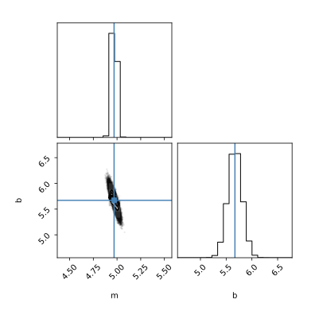

========
dataprob
========

dataprob was designed to allow scientists to easily fit user-defined models to 
experimental data. It allows maximum likelihood, bootstrap, and Bayesian
analyses with a simple and consistent interface. 

Design principles
=================

+ **ease of use:** Users write a python function that describes their model, 
  then load in their experimental data as a dataframe. 
+ **dataframe centric:** Uses a pandas dataframe to specify parameter bounds,
  guesses, fixedness, and priors. Observed data can be passed in as a
  dataframe or numpy vector. All outputs are pandas dataframes. 
+ **consistent experience:** Users can run maximum-likelihood, bootstrap 
  resampling, or Bayesian MCMC analyses with an identical interface and nearly
  identical diagnostic outputs. 
+ **interpretable:** Provides diagnostic plots and runs tests to validate
  fit results. 

Simple example
==============

The following code generates noisy linear data and uses dataprob to find 
the maximum likelihood estimate of its slope and intercept. 
`Run on Google Colab <https://githubtocolab.com/harmslab/dataprob/blob/main/examples/simple-example.ipynb>`_.

.. code-block:: python
    
    import dataprob
    import numpy as np

    # Generate "experimental" linear data (slope = 5, intercept = 5.7) that has
    # random noise on each point. 
    x_array = np.linspace(0,10,25)
    noise = np.random.normal(loc=0,scale=0.5,size=x_array.shape)
    y_obs = 5*x_array + 5.7 + noise

    # 1. Define a linear model
    def linear_model(m=1,b=1,x=[]):
        return m*x + b

    # 2. Set up the analysis. 'method' can be "ml", "mcmc", or "bootstrap"
    f = dataprob.setup(linear_model,
                       method="ml",
                       non_fit_kwargs={"x":x_array})

    # 3. Fit the parameters of linear_model model to y_obs, assuming uncertainty
    #    of 0.5 on each observed point. 
    f.fit(y_obs=y_obs,
          y_std=0.5)

    # 4. Access results
    fig = dataprob.plot_summary(f)
    fig = dataprob.plot_corner(f)
    print(f.fit_df)
    print(f.fit_quality)

The plots will be:

.. image:: docs/source/_static/simple-example_plot-summary.svg
    :align: center
    :alt: data.plot_summary result
    :width: 75%

The ``f.fit_df`` dataframe will look something like:

+-------+-------+----------+-------+--------+---------+-------+-----------+
| index | name  | estimate | std   | low_95 | high_95 | ...   | prior_std |
+=======+=======+==========+=======+========+=========+=======+===========+
| ``m`` | ``m`` | 5.009    | 0.045 | 4.817  | 5.202   | ...   | ``NaN``   |  
+-------+-------+----------+-------+--------+---------+-------+-----------+
| ``b`` | ``b`` | 5.644    | 0.274 |  4.465 | 6.822   | ...   | ``NaN``   |
+-------+-------+----------+-------+--------+---------+-------+-----------+

The ``f.fit_quality`` dataframe will look something like:

+---------------+---------------------------------------------+---------+---------+
| name          | description                                 | is_good | value   |
+===============+=============================================+=========+=========+
| num_obs       | number of observations                      | True    | 25.000  |
+---------------+---------------------------------------------+---------+---------+
| num_param     | number of fit parameters                    | True    | 2.000   |
+---------------+---------------------------------------------+---------+---------+
| lnL           | log likelihood                              | True    | -18.761 |
+---------------+---------------------------------------------+---------+---------+
| chi2          | chi^2 goodness-of-fit                       | True    | 0.241   |
+---------------+---------------------------------------------+---------+---------+
| reduced_chi2  | reduced chi^2                               | True    | 1.192   |
+---------------+---------------------------------------------+---------+---------+
| mean0_resid   | t-test for residual mean != 0               | True    | 1.000   |
+---------------+---------------------------------------------+---------+---------+
| durbin-watson | Durbin-Watson test for correlated residuals | True    | 2.265   |
+---------------+---------------------------------------------+---------+---------+
| ljung-box     | Ljung-Box test for correlated residuals     | True    | 0.943   |
+---------------+---------------------------------------------+---------+---------+

Installation
============

We recommend installing dataprob with pip:

.. code-block:: shell

    pip install dataprob

To install from source and run tests:

.. code-block:: shell

    git clone https://github.com/harmslab/dataprob.git
    cd dataprob
    pip install .

    # to run test-suite
    pytest --runslow

Examples
========

A good way to learn how to use the library is by working through examples. The
following notebooks are included in the `dataprob/examples/` directory. They are
self-contained demonstrations in which dataprob is used to analyze various
classes of experimental data. The links below launch each notebook in Google
Colab:

+ `api-example.ipynb <https://githubtocolab.com/harmslab/dataprob/blob/main/examples/api-example.ipynb>`_: shows various features of the API when analyzing a linear model
+ `linear.ipynb <https://githubtocolab.com/harmslab/dataprob/blob/main/examples/linear.ipynb>`_: fit a linear model to noisy data (2 parameter, linear)
+ `binding.ipynb <https://githubtocolab.com/harmslab/dataprob/blob/main/examples/binding.ipynb>`_: a single-site binding interaction (2 parameter, sigmoidal curve)
+ `michaelis-menten.ipynb <https://githubtocolab.com/harmslab/dataprob/blob/main/examples/michaelis-menten.ipynb>`_: Michaelis-Menten model of enzyme kinetics (2 parameter, sigmoidal curve)
+ `lagged-exponential.ipynb <https://githubtocolab.com/harmslab/dataprob/blob/main/examples/lagged-exponential.ipynb>`_: bacterial growth curve with initial lag phase (3 parameter, exponential)
+ `multi-gaussian.ipynb <https://githubtocolab.com/harmslab/dataprob/blob/main/examples/multi-gaussian.ipynb>`_: two overlapping normal distributions (6 parameter, Gaussian)
+ `periodic.ipynb <https://githubtocolab.com/harmslab/dataprob/blob/main/examples/periodic.ipynb>`_: periodic data (3 parameter, sine) 
+ `polynomial.ipynb <https://githubtocolab.com/harmslab/dataprob/blob/main/examples/polynomial.ipynb>`_: nonlinear data with no obvious form (5 parameter, polynomial)
+ `linear-extrapolation-folding.ipynb <https://githubtocolab.com/harmslab/dataprob/blob/main/examples/linear-extrapolation-folding.ipynb>`_: protein equilibrium unfolding data (6 parameter, linear embedded in sigmoidal)

Documentation
=============

Full documentation is on `readthedocs <https://dataprob.readthedocs.io>`_.
