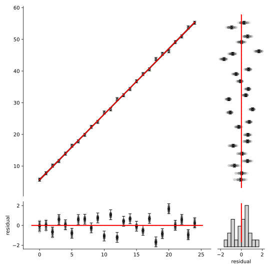
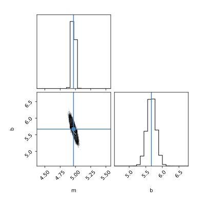

.. dataprob documentation master file

.. include:: links.rst

========
dataprob
========

dataprob lets scientists fit user-defined models to experimental data using a
simple, consistent interface. Write a Python function that describes your model,
pass in your observations, and choose a fitting method. dataprob handles the
rest (maximum likelihood, bootstrap resampling, or Bayesian posterior sampling)
and returns results as tidy pandas DataFrames.

Installation
============

.. code-block:: shell

    pip install dataprob

Quick example
=============

The following fits a linear model to noisy data using maximum likelihood.

.. code-block:: python

    import dataprob
    import numpy as np

    # Generate noisy linear data (slope=5, intercept=5.7)
    x = np.linspace(0, 10, 25)
    y_obs = 5*x + 5.7 + np.random.normal(0, 0.5, size=x.shape)

    # 1. Define the model
    def linear_model(m=1, b=1, x=[]):
        return m*x + b

    # 2. Set up the analysis
    f = dataprob.setup(linear_model,
                       method="ml",
                       non_fit_kwargs={"x": x})

    # 3. Fit
    f.fit(y_obs=y_obs, y_std=0.5)

    # 4. Results
    print(f.fit_df)
    fig = dataprob.plot_summary(f)
    fig = dataprob.plot_corner(f)

Overview
========

.. toctree::

   overview

Maximum Likelihood
==================

.. toctree::

   fitters/ml

Bootstrap
=========

.. toctree::

   fitters/bootstrap

Bayesian MCMC (emcee)
=====================

.. toctree::

   fitters/emcee

Bayesian MCMC (PyMC)
====================

.. toctree::

   fitters/pymc

Hamiltonian Monte Carlo
=======================

.. toctree::

   fitters/hmc
