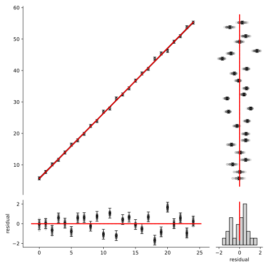
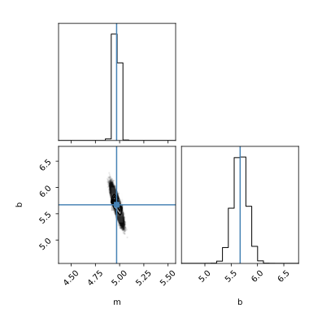
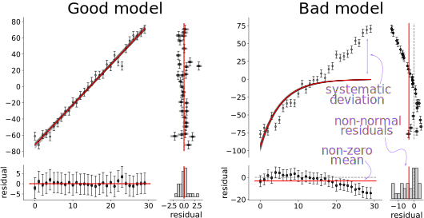

.. dataprob documentation master file, created by
   sphinx-quickstart on Tue Aug 20 16:28:23 2024.
   You can adapt this file completely to your liking, but it should at least
   contain the root `toctree` directive.

.. include:: links.rst

======================
dataprob documentation
======================

dataprob was designed to allow scientists to easily fit user-defined models to 
experimental data. It allows maximum likelihood, bootstrap, and Bayesian
analyses with a simple and consistent interface. 

Design principles
=================

+ **ease of use:** Users write a python function that describes their model, 
  then load in their experimental data as a dataframe. 
+ **dataframe centric:** Uses a pandas dataframe to specify parameter bounds,
  guesses, fixedness, and priors. Observed data can be passed in as a
  dataframe or numpy vector. All outputs are pandas dataframes. 
+ **consistent experience:** Users can run maximum-likelihood, bootstrap 
  resampling, or Bayesian MCMC analyses with an identical interface and nearly
  identical diagnostic outputs. 
+ **interpretable:** Provides diagnostic plots and runs tests to validate
  fit results. 

Simple example
==============

The following code generates noisy linear data and uses dataprob to find 
the maximum likelihood estimate of its slope and intercept. 
`Run on Google Colab <simple-example_>`_.

.. code-block:: python
    
    import dataprob
    import numpy as np

    # Generate "experimental" linear data (slope = 5, intercept = 5.7) that has
    # random noise on each point. 
    x_array = np.linspace(0,10,25)
    noise = np.random.normal(loc=0,scale=0.5,size=x_array.shape)
    y_obs = 5*x_array + 5.7 + noise

    # 1. Define a linear model
    def linear_model(m=1,b=1,x=[]):
        return m*x + b

    # 2. Set up the analysis. 'method' can be "ml", "mcmc", or "bootstrap"
    f = dataprob.setup(linear_model,
                       method="ml",
                       non_fit_kwargs={"x":x_array})

    # 3. Fit the parameters of linear_model model to y_obs, assuming uncertainty
    #    of 0.5 on each observed point. 
    f.fit(y_obs=y_obs,
          y_std=0.5)

    # 4. Access results
    fig = dataprob.plot_summary(f)
    fig = dataprob.plot_corner(f)
    print(f.fit_df)
    print(f.fit_quality)

The plots will be:

The ``f.fit_df`` dataframe will look something like:

+-------+-------+----------+-------+--------+---------+-------+-----------+
| index | name  | estimate | std   | low_95 | high_95 | ...   | prior_std |
+=======+=======+==========+=======+========+=========+=======+===========+
| ``m`` | ``m`` | 5.009    | 0.045 | 4.817  | 5.202   | ...   | ``NaN``   |  
+-------+-------+----------+-------+--------+---------+-------+-----------+
| ``b`` | ``b`` | 5.644    | 0.274 |  4.465 | 6.822   | ...   | ``NaN``   |
+-------+-------+----------+-------+--------+---------+-------+-----------+

The ``f.fit_quality`` dataframe will look something like:

+---------------+---------------------------------------------+---------+---------+
| name          | description                                 | is_good | value   |
+===============+=============================================+=========+=========+
| success       | fit success status                          | True    | True    |
+---------------+---------------------------------------------+---------+---------+
| num_obs       | number of observations                      | True    | 25.000  |
+---------------+---------------------------------------------+---------+---------+
| num_param     | number of fit parameters                    | True    | 2.000   |
+---------------+---------------------------------------------+---------+---------+
| lnL           | log likelihood                              | True    | -18.761 |
+---------------+---------------------------------------------+---------+---------+
| chi2          | chi^2 goodness-of-fit                       | True    | 0.241   |
+---------------+---------------------------------------------+---------+---------+
| reduced_chi2  | reduced chi^2                               | True    | 1.192   |
+---------------+---------------------------------------------+---------+---------+
| mean0_resid   | t-test for residual mean != 0               | True    | 1.000   |
+---------------+---------------------------------------------+---------+---------+
| durbin-watson | Durbin-Watson test for correlated residuals | True    | 2.265   |
+---------------+---------------------------------------------+---------+---------+
| ljung-box     | Ljung-Box test for correlated residuals     | True    | 0.943   |
+---------------+---------------------------------------------+---------+---------+

Installation
============

We recommend installing dataprob with pip:

.. code-block:: shell

    pip install dataprob

To install from source and run tests:

.. code-block:: shell

    git clone https://github.com/harmslab/dataprob.git
    cd dataprob
    pip install .

    # to run test-suite
    pytest --runslow

Examples
========

A good way to learn how to use the library is by working through examples. The
following notebooks are included in the `dataprob/examples/` directory. They are
self-contained demonstrations in which dataprob is used to analyze various
classes of experimental data. The links below launch each notebook in Google
Colab:

+ `api-example.ipynb <api-example_>`_: shows various features of the API when analyzing a linear model
+ `linear.ipynb <linear-example_>`_: fit a linear model to noisy data (2 parameter, linear)
+ `binding.ipynb <binding-example_>`_: a single-site binding interaction (2 parameter, sigmoidal curve)
+ `michaelis-menten.ipynb <michaelis-menten-example_>`_: Michaelis-Menten model of enzyme kinetics (2 parameter, sigmoidal curve)
+ `lagged-exponential.ipynb <lagged-exponential-example_>`_: bacterial growth curve with initial lag phase (3 parameter, exponential)
+ `multi-gaussian.ipynb <multi-gaussian-example_>`_: two overlapping normal distributions (6 parameter, Gaussian)
+ `periodic.ipynb <periodic-example_>`_: periodic data (3 parameter, sine) 
+ `polynomial.ipynb <polynomial-example_>`_: nonlinear data with no obvious form (5 parameter, polynomial)
+ `linear-extrapolation-folding.ipynb <linear-extrapolation-folding-example_>`_: protein equilibrium unfolding data (6 parameter, linear embedded in sigmoidal)

I. Set up an analysis
=====================

----------------
1. Write a model
----------------

The first step is to define a function that we think can reproduce our 
observations given some set of parameters. dataprob will find the values of
the `float <float-number_>`_ parameters passed to the function that reproduce
our observations. Such a function must meet two criteria:

+ The function must take parameters to fit. Parameters can be passed in as 
  float keyword arguments to the function or as a numpy array of floats. 
+ The function must return a numpy array the same length as the numpy array of 
  observations. 

For example, the function ``good_model`` below takes the arguments ``m``, ``b``,
and ``x``. If we pass in an array with 10 values for ``x``, the function 
returns an output array with 10 values. We can thus use it to reproduce the 10 
observations in ``y_obs``. 

.. code-block:: python

    # define a model
    def good_model(m,b,x):
        return m*x + b

    # Array of x from 0->9
    x_input = np.arange(10)
    x_input.shape # --> (10,)

    # y_calc has a line with a slope of 1 and an intercept of 2 calculated at
    # x from 0 to 9
    y_calc = good_model(m=1,b=2,x=x_input)
    y_calc.shape # --> (10,)

    # y_obs is a line with a slope of 5 and an intercept of 2 observed at x
    # from 0 to 9
    y_obs = x_input*5 + 2
    y_obs.shape # --> (10,)

-------------------
2. Set up the model
-------------------

We set up the analysis by calling ``dataprob.setup`` on our function to analyze.
This returns a ``Fitter`` object. (We will call this object ``f`` in this and
all following examples.) ``dataprob.setup`` guesses which parameters should be
fittable. By default, it treats the first ``n`` arguments of the input function
whose default is a ``float`` or ``None`` as fittable parameters. All remaining
arguments are treated as non-fittable. For example, in the following code block
``dataprob.setup`` identifies ``a`` and ``b`` as fit parameters, but not
``square``. 

.. code-block:: python

  def some_fcn(a,b=2,square=False):
    if square is True:
      return a**2 + b
    else:
      return a + b

  f = dataprob.setup(some_fcn)
  print(f.param_df["name"]) # -> ["a","b"]

One can change this behavior using the ``fit_parameters``, ``non_fit_kwargs``
and ``vector_first_arg`` arguments to  ``dataprob.setup``. A few patterns 
demonstrate how this works. 

.. code-block:: python

    # A function we wish to analyze
    def some_fcn(a=1,b=2,c=3):
        return a*b*c

    # a, b, and c are fit parameters with guesses of 1, 2, and 3, taken from 
    # their argument defaults. 
    f = dataprob.setup(some_fcn)

    # b and c are fit parameters with guesses of 2 and 3; a is a fixed
    # non-fittable parameter with value 1
    f = dataprob.setup(some_fcn,
                       fit_parameters=["b","c"])

    # a and c are fit parameters with guesses of 1 and 3; b is a non-fittable
    # parameter with a value of np.arange(20)
    f = dataprob.setup(some_fcn,
                       non_fit_kwargs={"b":np.arange(20)})

    # a and c are fit parameters with guesses of 14 and 7; b in a non-fittable
    # parameter with a value of np.arange(20)
    f = dataprob.setup(some_fcn,
                       fit_parameters={"a":14,"c":7},
                       non_fit_kwargs={"b":np.arange(20)})

The ``vector_first_arg`` argument enables one to use a function where the first 
argument is an array of parameters. This allows for computationally efficient 
models that deal exclusively in numpy arrays. Note that a ``fit_parameters``
argument is required if ``vector_first_arg == True``. Here is an example:

.. code-block:: python

    def some_fcn(a,b=2,c=3):
        return a*b*c

    # Treat "a" as a vector rather than as a single parameter. This vector is 
    # built from parameters w, x, y, and z. (Assigned default guesses of 0). b 
    # and c are fixed non-fittable parameters with values of 2 and 3. 
    f = dataprob.setup(some_fcn,
                       vector_first_arg=True,
                       fit_parameters=["w","x","y","z"])

    # When running the analysis, dataprob will do the following under the hood. 
    y_calc = some_fcn(a=np.array([w,x,y,z]),b=2,c=3)

One can even more finely control the assignment of fittable parameters: see the
`Advanced Model Definitions`_ section for details. 

-------------------------------
3. Customize the fit parameters
-------------------------------

Once we have defined our model and assigned which parameters are fittable, we
can control seven attributes of each fittable parameter. These are stored in
``f.param_df`` dataframe. Each row is a parameter; each column is an attribute. 

.. code-block:: python
    
    def some_fcn(a,b=2,c=3):
        return a*b*c

    f = dataprob.setup(some_fcn)

    f.param_df

+-------+-------+-----------+-------------+-------------+------------+-----------+
| name  | guess | fixed     | lower_bound | upper_bound | prior_mean | prior_std |
+=======+=======+===========+=============+=============+============+===========+
| ``a`` | 0.0   | ``False`` | ``-inf``    | ``inf``     | ``NaN``    | ``NaN``   |
+-------+-------+-----------+-------------+-------------+------------+-----------+
| ``b`` | 2.0   | ``False`` | ``-inf``    | ``inf``     | ``NaN``    | ``NaN``   |
+-------+-------+-----------+-------------+-------------+------------+-----------+
| ``c`` | 3.0   | ``False`` | ``-inf``    | ``inf``     | ``NaN``    | ``NaN``   |
+-------+-------+-----------+-------------+-------------+------------+-----------+

The ``f.param_df`` dataframe can be accessed and edited using standard 
`pandas DataFrame <pandas-dataframe_>`_ commands. The ``name`` column is set
when the dataframe is initialized and cannot be changed. The ``name`` column is
used as the index for the dataframe, allowing commands like the following, which
sets the ``guess`` of parameter ``a`` to 10.0: 

.. code-block:: python

    # set the guess of parameter a to 10.0.
    f.param_df.loc["a","guess"] = 10.0

One can also edit the dataframe en masse and load in directly:

.. code-block:: python

    df = f.param_df.copy()

    # do lots of edits to dataframe
    # ... 
    # ...
    # then:

    f.param_df = df

One can even load ``param_df`` directly from a spreadsheet. 

.. code-block:: python

    f.param_df.to_excel("my-parameters.xlsx")

    # edit my-parameters.xslx in excel. 

    f.param_df = "my-parameters.xslx"

The full rules for the parameter dataframe are:

+-----------------+---------------------------------------------------------+
| key             | value                                                   |
+=================+=========================================================+
| ``name``        | string name of the parameter. should not be changed     |
|                 | by the user once the fitter is initialized.             |
+-----------------+---------------------------------------------------------+
| ``guess``       | initial guess as single float value (must be non-nan    |
|                 | and within bounds if specified)                         |
+-----------------+---------------------------------------------------------+
| ``fixed``       | whether or not parameter can vary during the analysis;  |
|                 | ``True`` or ``False``. if ``False`` use the value in    |
|                 | ``guess`` for this argument when calling the function.  |
+-----------------+---------------------------------------------------------+
| ``lower_bound`` | parameter constrained to be ``>= lower_bound``. single  |
|                 | float value; ``-np.inf`` allowed; ``None``, ``np.nan``, |
|                 | or ``pd.NA`` interpreted as ``-np.inf``.                |
+-----------------+---------------------------------------------------------+
| ``upper_bound`` | parameter constrained to be ``<= upper_bound``. single  |
|                 | float value; ``np.inf`` allowed; ``None``, ``np.nan``,  |
|                 | or ``pd.NA`` interpreted as ``np.inf``.                 |
+-----------------+---------------------------------------------------------+
| ``prior_mean``  | single float value; ``np.nan`` allowed (see note)       |
+-----------------+---------------------------------------------------------+
| ``prior_std``   | single float value; ``np.nan`` allowed (see note)       |
+-----------------+---------------------------------------------------------+

.. note:: 

    An MCMC analysis requires prior distributions for each parameter. (See the
    `Bayesian MCMC`_ section for details). Priors are specified using the 
    ``prior_mean`` and ``prior_std`` columns. Together, these define a Gaussian
    prior with a mean of ``prior_mean`` and a standard deviation of
    ``prior_std``. Because they specify a Gaussian distribution, neither
    value can be ``np.inf`` and ``prior_std`` must be greater than zero.  If
    both a Gaussian prior and bounds are defined, the Gaussian distribution is
    trimmed and re-normalized so its probability density function sums to one
    between the bounds. To use uniform priors between the bounds, set both 
    ``prior_mean`` and ``prior_std`` to ``np.nan``. 

-----------------------------
4. Set non-fittable arguments
-----------------------------

One can specify arguments to the function that should not be used as fit
parameters using the ``non_fit_kwargs`` dictionary. This can be passed as an
argument to ``dataprob.setup``. All keys must correspond to function arguments,
except in the `special case <Functions with \*\*kwargs_>`_ where a function
takes ``**kwargs``. The ``non_fit_kwargs`` dictionary can be accessed and edited
after initialization; it is exposed as an attribute to ``f``. In the following
example, we initially set the value of ``square`` to be ``True``, then update
that to be ``False``. 

.. code-block:: python
    
    def some_fcn(a,b=2,square=False):
        if square is True:
            return (a*b)**2
        else:
            return (a*b)

    # Initially set square to True
    f = dataprob.setup(some_fcn,
                       non_fit_kwargs={"square":True})
    
    # Oops, changed our mind. Set back to False
    f.non_fit_kwargs["square"] = False

II. Run an Analysis
===================

----------------------------
1. Select an analysis method
----------------------------

dataprob has three analysis methods to estimate parameter values. These are
selected via the ``method`` argument to ``dataprob.setup``: 
:code:`f = setup(some_fcn,method="ml")`. If no method is specified, the ``ml``
method will be used. The available methods are:
    
+ **ml** (default). Do a maximum likelihood (i.e. least-squares) fit, regressing
  model parameters against observed data. It finds the parameters that minimize
  the weighted residual function. `Details <Maximum likelihood_>`_. 

+ **bootstrap**: Estimate parameter distributions consistent with observed data
  by sampling observation uncertainty, then finding maximum likelihood 
  parameter estimates for each pseudo-replicate dataset. `Details <Bootstrap_>`_.

+ **mcmc**: Use Markov-Chain Monte Carlo sampling to estimate the posterior 
  distributions of model parameters. By default, the analysis uses uniform
  priors; however, the user can also specify Gaussian priors. `Details <Bayesian MCMC_>`_.

--------------------
2. Load observations
--------------------

All analyses require the user specify a vector of observations (``y_obs``) and
a vector of standard deviations on the value of each observation (``y_std``).
The software will estimate model parameters that reproduce the observations in
``y_obs``,  weighted by the confidence in each observation encoded  by
``y_std``. ``y_obs`` and ``y_std`` must be non-nan float values. Further, all
values in ``y_std`` must be larger than zero. 

The analysis makes several assumptions about ``y_obs`` and ``y_std``. 

+ The error of the independent variable is negligible. For example, if you were
  to measure the progress of a chemical reaction over time, this software 
  assumes no error in your time measurement. 
+ The errors in each observation are independent. 
+ The uncertainty for each observation value is normally distributed, with a 
  standard deviation of ``y_std``. 

.. note:: 

    dataprob assumes the ``y_std`` are `population standard deviations <pop-std_>`_, 
    not sample standard deviations. We therefore recommend that users 
    calculate ``y_std`` as:

    .. math::

        \sigma = \sqrt{ \frac{1}{N-1} \sum_{i=0}^{i < N-1} \left ( x_{i} - \mu \right )^2}

    where :math:`N` is the number of replicates for a given observation and 
    :math:`\mu` is the mean of the replicates.

.. note:: 

    A typical way to estimate ``y_std`` is via technical replicates on each 
    observed point. Sometimes this is not possible. In this case, one can 
    declare a global ``y_std`` for all points based on an overall estimate of
    observation precision. For example, one might take the standard deviation of
    points from a flat experimental baseline and use that as the value for 
    ``y_std`` on all points. One could even "make up" a value that "seems
    plausible" given the instrument setup and collected data. If one uses the
    same ``y_std`` for all points, the chosen value will not alter the parameter
    estimates, but it will directly impact the final parameter estimate
    uncertainty. We thus recommend being conservative and assuming your error is
    on the large side of plausible. **If you underestimate y_std,
    you overestimate parameter precision!!!** The 
    `reduced chi2 output <Model goodness-of-fit_>`_ output from ``f.fit_quality``
    can help you decide if you are grossly under- or over-estimating your
    observation uncertainty. 

``y_obs`` and ``y_std`` can be passed to the program in two different ways.
The first is via ``f.fit``:

.. code-block:: python
    
    def some_fcn(a,b=2,c=3):
        return a*b*c

    f = dataprob.setup(some_fcn)

    f.fit(y_obs=y_obs,
          y_std=y_std)                       

The ``f.fit`` call also allows the user to specify a single, global ``y_std`` to
use for all parameters:

.. code-block:: python
    
    def some_fcn(a,b=2,c=3):
        return a*b*c

    f = dataprob.setup(some_fcn)

    # apply uncertainty of 0.1 to all observations
    f.fit(y_obs=y_obs,
          y_std=0.1)  

In addition to using ``f.fit``, one can set ``y_obs`` and ``y_obs`` from a
dataframe via the ``data_df`` attribute. 

.. code-block:: python
    
    import pandas as pd

    df = pd.DataFrame({"y_obs":y_obs,
                       "y_std":y_std})

    f = dataprob.setup(some_fcn)

    f.data_df = df

    f.fit()        

A dataframe passed to ``data_df`` must have a ``y_obs`` and a ``y_std`` column.
All other columns are ignored. The input dataframe must be either a pandas
``DataFrame`` or a string pointing to a spreadsheet that can be read by pandas. 

-------------------
3. Run the analysis
-------------------

As described above, we run the analysis by calling ``f.fit()``. Each method
has different options that can be passed to the ``fit`` method. A description of
these options can be accessed via ``help``. 

.. code-block:: python

    # A function we wish to analyze
    def some_fcn(a=1,b=2,c=3):
        return a*b*c

    f = dataprob.setup(some_fcn,
                       method="mcmc")

    help(f.fit)

.. code-block:: 

  Help on method fit in module dataprob.fitters.bayesian.bayesian_sampler:

  fit(y_obs=None, y_std=None, num_walkers=100, use_ml_guess=True,num_steps=100, burn_in=0.1, num_threads=1, **emcee_kwargs) method of dataprob.fitters.bayesian.bayesian_sampler.BayesianSampler instance
    
    Perform Bayesian MCMC sampling of parameter values. 

    Parameters
    ----------
    y_obs : numpy.ndarray
        observations in a numpy array of floats that matches the shape
        of the output of some_function set when initializing the fitter.
        nan values are not allowed. y_obs must either be specified here
        or in the data_df dataframe.
    y_std : numpy.ndarray
        standard deviation of each observation. nan values are not allowed.
        y_std must either be specified here or in the data_df dataframe. 
    num_walkers : int, default=100
        number of markov chains to use in the analysis
    use_ml_guess : bool, default=True
        if true, do a maximum likelihood maximization then sample from the
        fit parameter covariance matrix to get the initial chain positions
    num_steps: int, default=100
        number of steps to run each markov chain
    burn_in : float, default = 0.1
        fraction of samples to discard from the start of the run
    num_threads : int
        number of threads to use.  if `0`, use the total number of cpus.
        [NOT YET IMPLEMENTED]
    **emcee_kwargs : 
        all remaining keyword arguments are passed to the initialization 
        function of emcee.EnsembleSampler

III. Results
============

dataprob generates outputs that allow the users to view and assess their 
fit results. 

-------------------------
Parameter values (fit_df)
-------------------------

One accesses the parameter estimates via the ``f.fit_df`` pandas dataframe. The
``fit_df`` output from the `Simple example`_ above is:

+-------+-------+----------+-------+--------+---------+-------+-----------+
| index | name  | estimate | std   | low_95 | high_95 | ...   | prior_std |
+=======+=======+==========+=======+========+=========+=======+===========+
| ``m`` | ``m`` | 5.009    | 0.045 | 4.817  | 5.202   | ...   | ``NaN``   |  
+-------+-------+----------+-------+--------+---------+-------+-----------+
| ``b`` | ``b`` | 5.644    | 0.274 |  4.465 | 6.822   | ...   | ``NaN``   |
+-------+-------+----------+-------+--------+---------+-------+-----------+

All three methods (ml, bootstrap, and mcmc) will have identical columns. These
columns report similar, but not identical, features of each parameter for each
method. 

**ml**
  + ``estimate``: maximum-likelihood parameter estimate
  + ``std``: standard deviation of a parameter uncertainty distribution
    calculated assuming normally distributed error centered on the
    maximum-likelihood estimate. Distribution width is determined by the local
    curvature of the likelihood surface. (See the `Maximum likelihood`_ section
    for details.)
  + ``low_95`` and ``high_95``: 95% of the distribution described above falls
    between low_95 and high_95. This defines the 95% `confidence interval
    <confidence-interval_>`_. 

**bootstrap**
  + ``estimate``: the mode of the parameter values seen in the bootstrap
    pseudo-replicates.
  + ``std``: standard deviation of this parameter over the  pseudo-replicate fits.
  + ``low_95`` and ``high_95``: 95% of pseudo-replicate fit distribution falls
    between low_95 and high_95. This is determined numerically, making no 
    assumption about the shape of the distribution. This defines the 95% 
    `confidence interval <confidence-interval_>`_. 

**mcmc**
  + ``estimate``: the mode of the parameter values seen in the posterior 
    distribution. 
  + ``std``: standard deviation of this parameter over the posterior distribution.
  + ``low_95`` and ``high_95``: 95% of posterior distribution falls
    between low_95 and high_95. This is determined numerically, making no 
    assumption about the shape of the distribution. This defines the 
    95% `credible interval <credible-interval_>`_.

In addition to the analysis output, the ``fit_df`` column holds the parameter
constraints that went into the analysis (``guess``, ``fixed``, ``upper_bound``,
``lower_bound``, ``prior_mean``, and ``prior_std``). 

One can save this dataframe out to a spreadsheet
(``fit_df.to_excel("fit-results.xlsx")``) to preserve both the parameter fit
results and parameter inputs in a single file.

-----------------------
Model outputs (data_df)
-----------------------

After a fit is run, the ``f.data_df`` dataframe--which started with only 
``y_obs`` and ``y_calc``--now has three new columns: 

+ ``y_calc``: the model calculated using the parameters in ``f.fit_df["estimate"]``.
+ ``unweighted_residuals``: the difference between the model and the data 
  (``y_calc - y_obs``)
+ ``weighted_residuals``: the difference between the model and the data weighted
  by observation uncertainty (``(y_calc - y_obs)/y_std``). 

One might call something like the following to make a plot of experimental 
points in ``y_obs`` with a line showing ``y_calc``. 

.. code:: python

  from matplotlib import pyplot as plt

  plt.plot(f.data_df["y_obs"],"o")
  plt.plot(f.data_df["y_calc"],"-")

------------
Summary plot
------------

The summary plot allows the user to assess how well the model reproduces the
observations with four combined plots. 

.. code:: python

  # assuming f is a Fitter object for which f.fit() has been run
  fig = dataprob.plot_summary(f)
  fig.savefig("summary-plot.pdf")

Here is an example output for a six-parameter model of protein folding (see this
`notebook <linear-extrapolation-folding-example_>`_ for details).  

The **central plot** shows ``y_obs`` (y-axis) in the order they came in via the 
input array (x-axis). Each point is an observation with its ``y_std`` shown as
error bars. The red line shows the output of the model calculated using the
parameters in ``f.fit_df["estimate"]``. The cloud of gray lines shows the output
of the model calculated with parameters drawn from ``f.samples``. 

The **lower plot** shows the model residuals as a function of observation number, 
while the **right plot** shows the model residuals as a function of ``y_obs``.
The residual is calculated as ``(y_calc - y_obs)/y_std``, where ``y_calc`` is
calculated using the parameters in ``f.fit_df["estimate"]``. The error bars are
``y_std``. The cloud of gray points are residuals when the model is calculated 
using parameters drawn from ``f.samples``. The red line shows the residual mean. 

The **bottom right plot** shows a histogram of the residual values, using an
x-axis shared by the plot above. 

For help interpreting these outputs, see the `Assessing fit quality`_ section.

One can control the style of the plot with the arguments passed to
``dataprob.plot_summary``. Key arguments include:

+ ``x_axis`` is a list of values to use for the x-axis. The length of this list
  must match the length of ``y_obs``. If this is not specified, ``y_obs`` are
  simply plotted sequentially. 
+ ``plot_unweighted`` allows the user to select whether to plot weighted or 
  unweighted residuals. 
+ ``x_label`` and ``y_label`` allow the user to label the axes.   
+ The ``*_style`` arguments alow the user to control how the plot 
  components are drawn. These should be dictionaries holding arguments to be 
  passed to `matplotlib plot <pyplot_>`_ calls. For example, one could use
  :code:`y_obs_style={"marker":"+"}` to change the marker style for the 
  data points to ``+`` symbols. The dictionaries available are 

  + ``y_obs_style`` for observations, passed to
    `matplotlib scatter <pyplot-scatter_>`_.
  + ``y_std_style`` for observation standard deviations, passed to 
    `matplotlib errorbar <pyplot-errorbar_>`_.
  + ``y_calc_style`` for model lines in main plot and residuals, passed to
    `matplotlib plot <pyplot_>`_.
  + ``sample_line_style`` for sample lines in main plot, passed to 
    `matplotlib plot <pyplot_>`_.
  + ``sample_point_style`` for sample points in residuals plots, passed to 
    `matplotlib scatter <pyplot-scatter_>`_.
  + ``hist_bar_style``, for bars in residual histogram, passed to
    `matplotlib fill <pyplot-fill_>`_.

---------------------
Assessing fit quality
---------------------

A model that describes the data well will have three features. These are: 

1. The residuals will be normally distributed.
2. The residuals will have a mean of zero. 
3. There will be no systematic deviation between the model and data (implying 
   the residuals will be uncorrelated). 

The following graphic compares a good model (left) to a bad model (right), 
highlighting the problems in purple. 

Aside from allowing visual assessment, dataprob calculates quality metrics for
each fit. These are accessible via the ``f.fit_quality`` dataframe. The
dataframe has the name and description of each analysis, whether the model
passes the test (``is_good``) and the value of the test result (``value``). The
dataframe also has a ``message`` column (omitted below) to help the user 
interpret the results. The results for the "bad model" fit are shown below:

+---------------+---------------------------------------------+---------+---------+
| index         | description                                 | is_good | value   |
+===============+=============================================+=========+=========+
| success       | fit success status                          | True    | True    | 
+---------------+---------------------------------------------+---------+---------+
| num_obs       | number of observations                      | True    | 30.0    | 
+---------------+---------------------------------------------+---------+---------+
| num_param     | number of floating fit parameters           | True    | 2.0     | 
+---------------+---------------------------------------------+---------+---------+
| lnL           | log likelihood                              | True    | -652.94 | 
+---------------+---------------------------------------------+---------+---------+
| chi2          | chi^2 goodness-of-fit                       | False   | 0.0     |
+---------------+---------------------------------------------+---------+---------+
| reduced_chi2  | reduced chi^2                               | False   | 42.748  |
+---------------+---------------------------------------------+---------+---------+
| mean0_resid   | t-test for residual mean != 0               | False   | 0.0018  |
+---------------+---------------------------------------------+---------+---------+
| durbin-watson | Durbin-Watson test for correlated residuals | False   | 0.036   |
+---------------+---------------------------------------------+---------+---------+
| ljung-box     | Ljung-Box test for correlated residuals     | False   | 0.000   |
+---------------+---------------------------------------------+---------+---------+

The first four entries describe the model: 

+ Whether or not the fit terminated successfully
+ The number of floating parameters
+ The number of observations in ``y_obs``
+ The log likelihood of the parameters in ``f.fit_df["estimate"]`` 

``num_obs`` and ``lnL`` will always have ``is_good == True``. ``num_param`` will
fail if the number of parameters is greater than the number of observations. 

The remaining entries allow the user to assess model quality. 

Model goodness-of-fit
---------------------

The ``chi2`` and ``reduced chi2`` statistics assess whether the distribution of
residuals matches what we would expect for a well-fit model. This corresponds to
a test for  "non-normal residuals" from the figure above. 

+ **chi2**

  This runs a :math:`\chi ^{2}` goodness-of-fit analysis. The null 
  hypothesis for this test is that the fit residuals can be described by a 
  :math:`\chi ^{2}` distribution. If the distribution is extreme enough to
  reject the null hypothesis (p < 0.05), ``is_good`` will be set to ``False``
  and the following ``message`` entry will appear:

    A p-value of [P_VALUE < 0.05] for the a goodness-of-fit Chi^2 test is evidence
    that the model does not describe the model well (model violation). Look for
    regions where your model systematically deviates from your data.

  If this test fails, you may need to use a different model to describe your
  data. 

+ **reduced chi2**:

  This calculates the reduced :math:`\chi ^{2}` (:math:`\chi ^{2}/N` where
  :math:`N` is the number of fit parameters). This ratio should be about 1 for a
  well-fit model. If the value differs from one, dataprob will set ``is_good`` to 
  ``False`` and return one of the following messages.

  If the reduced :math:`\chi ^{2}` is greater than 1.25:

    A reduced chi^2 value [VALUE > 1.25] may mean the model does not describe
    the data well or that the uncertainty on each point is underestimated.

  If the model is passing all other tests, you likely underestimated ``y_std``. 
  Try increasing the magnitude of this value. If the model is failing other
  tests---particularly the Durbin-Watson and or the Ljung-Box tests for residual
  correlation---you should likely use a different model to describe the data. 
  
  If the reduced :math:`\chi^{2}` is below 0.75:

    A reduced chi^2 value [VALUE < 0.75] may mean the model is overfit or that
    the uncertainty on each point is overestimated.

  This could occur if you were too conservative in your estimated uncertainty
  on each observation. Alternatively, this could mean you have more fit 
  parameters than can be constrained by your data (`overfitting <overfit_>`_). 
  One way to check for this is to examine the `Corner plot`_ for parameters 
  that strongly co-vary with one another. 
  
Residuals with zero mean
------------------------

+ **residual mean is zero**

  This runs a one-sampled, two-tailed t-test to see whether we can reject the 
  null hypothesis that the mean of your your residuals is zero. If this p-value
  is less than 0.05, this test will set ``is_good`` to ``False`` and set the 
  following message.
  
    A p-value of [P_VALUE < 0.05] for the one-sample t-test is evidence for fit
    residuals with a non-zero mean. This may mean your model does not describe your
    data well (model violation). Look for regions where your model systematically
    deviates from your data.
  
  If this test fails, you may need to use a different model to describe your
  data. 

Residual correlation
--------------------

A well-fit model should have residuals that are uncorrelated along ``y_obs``. 
Uncorrelated residuals arise from uncorrelated uncertainty in each observation;
correlated residuals arise when the model systematically differs from the 
observational data. dataprob runs two tests for correlated residuals. 

+ **Durbin-Watson**
  
  The `Durbin-Watson <durbin-watson_>`_ test looks for correlation in residuals.
  It is designed so the test statistic :math:`D` ranges from 0 to 4. 

  .. math::
      D = \frac{\sum_{i=1}^{i<n}(r_{i}-r_{i-1})^{2}}{\sum_{i=0}^{i<n}e_{i}^{2}}

  + if :math:`D` is 2, it there is no detected correlation
  + if :math:`D` is less than 2, it is evidence of positive autocorrelation
  + if :math:`D` is more than 2, it is evidence of negative autocorrelation 

  If :math:`D` is less than one of greater than three, dataprob will set 
  ``is_good`` to ``False`` and set one of the following messages. Either:

    A Durbin-Watson test-statistic [VALUE < 1] is is evidence for positively
    correlated fit residuals. This may mean your model does not describe your data
    well (model violation). Look for regions where your model systematically
    deviates from your data.

  or:

    A Durbin-Watson test-statistic [VALUE > 3] is is evidence for negatively
    correlated fit residuals. This may mean your model does not describe your data
    well (model violation). Look for regions where your model systematically
    deviates from your data.

  If this test fails, you may need to use a different model to describe your
  data. 

+ **Ljung-Box**

  The `Ljung-Box <ljung-box_>`_ test looks for correlation in residuals. Its 
  test statistic :math:`Q` is expected to follow a :math:`\chi ^{2}` 
  distribution. The test statistic is:

  .. math::
      Q = n(n + 2) \sum_{k=1}^{m} (n - k)^{-1}\hat{r}^{2}_{k}

  where :math:`n` is the length of the residuals vector, :math:`k` is the 
  lag, :math:`m` is the number of lags compared (:math:`m = n - 1` as 
  implemented in dataprob), and :math:`\hat{r}` is the residuals. :math:`Q` is
  expected to follow a :math:`\chi^{2}` distribution. If :math:`Q` is more   
  extreme than :math:`\chi^{2}` for a given :math:`\alpha` and number of degrees
  of freedom, we reject the null hypothesis of uncorrelated residuals. If this
  p-value is less than 0.05, dataprob will set  ``is_good`` to ``False`` and
  set the following message.

    A p-value of [P_VALUE < 0.05] for the Ljung-Box test is evidence for
    correlated fit residuals. This may mean your model does not describe your data
    well (model violation). Look for regions where your model systematically
    deviates from your data.

  If this test fails, you may need to use a different model to describe your
  data. 

-----------
Corner plot
-----------

The corner plot allows the user to visually assess how well determined each 
parameter is and the extent to which parameters estimates co-vary with 
one another. The meaning of the distributions is slightly different for each 
method; see the `Samples`_ section below for details. 

In the example above, we see that the ``dG_unfold`` parameter varies between 
about -10 and -15 (top left) and that ``m_unfold`` varies between -5.5 and -3.5
(bottom right). These values are not independent of one another. The 
correlation plot (bottom left) reveals that the estimates of the two parameters
strongly co-vary. Knowing about co-variation is helpful for a number of reasons.

1. If the reduced :math:`\chi ^{2}` suggests over fitting, the corner plot can
   reveal which parameters are unconstrained and should be fixed or removed 
   from the model. 
2. If we have two correlated parameters and can find an independent way to 
   estimate one of the parameters -- say, with a different experiment -- we know
   we can then estimate the other parameter. 
3. It might make sense to fold these two parameters into a single parameter. 
   From the example above, we might re-write the model with a single parameter
   that is the ratio of ``dG_unfold`` and ``m_value`` .
4. When presenting results in a publication, a co-variation plot allows the 
   reader to understand what an uncertainty like 
   :math:`\Delta \hat{G}_{unfold} = -12.5 \pm 2.5` means with respect to the 
   other parameters in the dataset. 

One feature of ``datprob.plot_corner`` is the ability to filter parameters. 
The model above has six parameters, many of which are 'nuisance' parameters that
are important fo the fit but do not provide information about the (in this case)
protein chemistry. We generated the above plot using the following command:

.. code:: python

    dataprob.plot_corner(f,filter_params=["native","denat"]))

This removed any parameter that had the text "native" or "denat" in its name. 
If we run the same call without the filter, we get the full corner plot with
all six parameters. 

This larger plot is useful--and should generally be checked to make sure nothing
crazy is going on with the nuisance parameters--but it also buries the results 
for the the two parameters we care the most about (``dG_unfold`` and ``m_unfold``). 
See ``help(dataprob.plot_corner)`` for details on how to do this filtering. 

-------
Samples
-------

After ``f.fit()`` runs, a fitter object will have an attribute ``f.samples``.
This is an numpy array with shape ``(num_samples,num_params)`` that holds 
vectors of parameters sampled from the conditional parameter probability
distribution. These samples are used to draw the gray fit lines in a summary
plot and to construct the distributions in a corner plot. The samples are
calculated in different ways for the three methods. 

+ **ml**: Samples parameter values from the covariance matrix assuming that the
  parameter uncertainty is normally distributed and centered on the maximum
  likelihood parameter estimate. See the `Maximum likelihood`_ section for
  details.
+ **bootstrap**: Each sample is a the result of a maximum likelihood fit of the
  model to a pseudo-replicate dataset generated by sampling from 
  observation uncertainty. See the `Bootstrap`_ section for
  details.
+ **mcmc**: Records the the locations of Markov chains in parameter space as
  they traverse the space by Metropolis Monte Carlo. Each sample is a draw 
  from the conditional parameter posterior distribution. See the 
  `Bayesian MCMC`_ section for details. 

One can also run the ``f.get_sample_df()`` method to get a dataframe holding 
the sample outputs rather than sample parameter estimates. This will look 
something like the following, where ``y_calc`` is calculated using the 
parameters in ``f.fit_df["estimate"]`` and the columns beginning with ``s00`` 
are the model evaluated with the sampled parameter values. 

+-------+-------+-------+---------+---------+-----+
| y_obs | y_std | y_calc| s000000 | s000001 | ... |
+=======+=======+=======+=========+=========+=====+
| -5    | 1     | -4.9  | -4.8    | -5.2    | ... |
+-------+-------+-------+---------+---------+-----+
| ...   | ...   | ...   | ...     | ...     | ... |
+-------+-------+-------+---------+---------+-----+

Analysis method details
=======================

------------------
Maximum likelihood
------------------

Description
-----------

The maximum likelihood (``"ml"``) method uses the `scipy.optimize.least_squares <scipy-least-squares_>`_
function to find parameters (:math:`\vec{x}`) that minimize the weighted
residuals between the model (:math:`y_{calc}(\vec{x})`) and our observations
(:math:`y_{obs}`). The weight on each observation is set to  :math:`1/y_{std}`,
meaning that observations with higher uncertainty contribute less in the
regression. The residual function for observation :math:`i` is given by:

.. math::
      
      r_{i}(\vec{x}) = (y_{calc,i}(\vec{x}) - y_{obs,i})/y_{std,i}

By default, dataprob will minimize the square of this function:

.. math::
      
      \sum_{i=0}^{i<N-1} (y_{calc,i}(\vec{x}) - y_{obs,i})^{2}/y_{std,i}^{2}

Implementation
--------------

The underlying ``scipy.optimize.least_squares`` function is extremely powerful
and flexible. Advanced users have full control over how this is called. Keyword
arguments may be passed into the ``f.fit`` function, which the passes them into
``least_squares``.  For example, the following code changes the least_squares 
loss function and verbosity. 

.. code-block:: python

    y_obs = np.arange(10)*5 - 14 + np.random.normal(0,1,size=10)

    def linear(m,b):
        return m*np.arange(10) + b
    
    f = dataprob.setup(linear)
    f.fit(y_obs=y_obs,
          y_std=0.1,
          loss="huber", # <- change least_squares loss function
          verbose=2)    # <- change least_squares verbosity

Parameter uncertainty
---------------------

To estimate parameter uncertainty, the ``ml`` method uses the curvature 
of the likelihood surface around the maximum likelihood parameter values.
Imagine we optimize a function with a single parameter, obtaining an ML estimate
of the parameter value. We then take the derivative of the likelihood function
at this value. 

+ If the local curvature is high, the likelihood decreases rapidly as we move
  away from the ML estimate, meaning the value of our parameter is tightly
  constrained by the data.

+ If the curvature is low, the likelihood does not change as our parameter
  value changes, meaning the value of our parameter is not constrained by the
  data. 

To convert the curvature into parameter uncertainty, we assume that the
error is normally distributed and centered on the maximum-likelihood estimate. 
The width is scaled by the inverse curvature: lower curvature, wider
distribution.

dataprob describes the curvature using the `Hessian matrix <hessian-matrix_>`_,
which can be approximated by :math:`(2 J^{T} J)`, where :math:`J` is the 
`Jacobian matrix <jacobian-matrix_>`_. (:math:`J` is automatically calculated and
returned by ``scipy.optimize.least_squares``.) This approach to parameter 
uncertainty is discussed `here <jac-to-hess_>`_ and in more detail
`here <gauss-newton_>`_. 

We calculate our estimated parameter distributions
(:math:`\vec{\mathcal{N}}(\hat{\mu},\hat{\sigma}^{2})`) as:

.. math:: 

    \vec{\mathcal{N}}(\hat{\mu},\hat{\sigma}^{2}) = \vec{\mathcal{N}}(\mu = 0,\sigma^{2}=1) \cdot H^{-1} + \vec{\hat{\mu}}

where :math:`\vec{\mathcal{N}}(\mu = 0,\sigma^{2}=1)` is an array of normal 
distributions with a mean of zero and standard deviation of one, :math:`H` is
the Hessian matrix, and :math:`\vec{\hat{\mu}}` is an array of the maximum
likelihood parameter estimates. 

This approach is unaware of parameter bounds, so the code truncates any regions
of the resulting distribution that fall outside user-specified fit parameter 
bounds. 

Outputs
-------

+ The ``f.fit_df`` dataframe reports the mean, standard deviation, and 95%
  confidence intervals of the estimated parameter uncertainty. 
+ The ``plot_corner(f)`` function plots histograms of the marginal distribution
  for each parameter, as well histograms showing the co-variation between pairs
  of parameter estimates as reflected in the inverse Hessian matrix. 
+ The ``f.samples`` attribute samples values from the covariance matrix 
  assuming that the parameter uncertainty is normally distributed and centered
  on the maximum likelihood parameter estimate. 

---------
Bootstrap
---------

Description
-----------

The ``bootstrap`` method performs maximum likelihood inferences on
pseudo-replicate datasets sampled from the observation uncertainty, then returns
the resulting distribution of parameter value estimates. 

The method assumes the uncertainty each observation :math:`i` is normally distributed,
with a mean of ``y_obs[i]`` and population standard deviation of ``y_std[i]``. 
It further assumes that each observation is independent. The ``bootstrap`` method
generates a defined number of pseudo-replicate datasets by sampling form these
values. For each pseudo-replicate it: 

1. Draws a random value for each observation from a normal distribution with
   that observation's mean and standard deviation. 
2. Uses ``scipy.optimize.least_squares`` to find the maximum likelihood estimate
   of the parameter values for that psuedo-replicate dataset. Because
   observation uncertainty is captured by the sampling process, the 
   regression for each pseudo-replicate uses the *unweighted* residuals:

   .. math::
         
       r(\vec{x}) = (y_{calc}(\vec{x}) - y_{obs})
 
   meaning the regression minimizes the following:
 
   .. math::
     
       \sum_{i=0}^{i<N-1} (y_{calc,i}(\vec{x}) - y_{obs,i})^{2}

Implementation
--------------

As with the ``ml`` method, one can pass keyword arguments to the ``.fit()`` 
method, which will then pass them to ``scipy.optimize.least_squares``. 

Outputs
-------

+ The ``f.fit_df["estimate"]`` is determined by finding the maximum of a 
  `Gaussian kernel density estimator <kde_>`_ applied to the ``f.samples``. This
  corresponds approximately to mode of the parameter estimates. 
+ The ``f.fit_df`` dataframe also reports the standard deviation and 95%
  confidence intervals of the marginal distribution across pseudo-replicates for
  each parameter. 
+ The ``plot_corner(f)`` function plots histograms of the marginal distribution
  for each parameter, as well histograms showing the co-variation between pairs
  of parameter estimates.  
+ The ``f.samples`` attribute has all pseudo-replicate results, and thus samples
  the full conditional distribution of parameter values. 

-------------
Bayesian MCMC
-------------

Description
-----------

In a Bayesian Markov-Chain Monte Carlo analysis, we are interested in the 
posterior distribution of model parameter values consistent with our data and
any prior information about our parameters. To do this, we sample parameter 
values using `Markov-Chain Monte Carlo <mcmc_>`_. In simple terms, we create 
a large number of walkers that traverse parameter space. Each walker then
iterates over the following steps:

1. Take a step (that is, alter one or more parameter values). 
2. Determine how this changes the `posterior probability <posterior-prob_>`_ by
   feeding the new parameters into the model and prior distributions.
3. Either keep or reject the step based on a `Metropolis criterion <metropolis-crit_>`_. 
   This criterion keeps all moves that increase the posterior probability and 
   stochastically keeps a subset of moves that decrease the posterior probability.
4. Record the current parameter values of the walker.
  
Each walker will spend the most of its time in high probability regions of 
parameter space, but will also wander briefly through low probability regions. 
When run for a sufficient amount of time, the paths taken by the walkers will
reveal the entire parameter posterior distribution. 

The posterior probability for a given parameter value is calculated from the
likelihood (:math:`P(y_{obs}|\vec{x})`) and the parameter prior (:math:`P(\vec{x})`).

Likelihood function
-------------------

The log-likelihood for a set of parameters :math:`\vec{x}` is given by the
following. Note that the core of the likelihood function is the weighted square
difference between ``y_calc`` and ``y_obs``. 

.. math::

  \text{ln} \left ( \mathcal{L}(\vec{x}) \right ) = - \frac{1}{2} \left ( \sum _{i=0} ^{i < N-1} \frac{ \left ( y _{i,calc}(\vec{x}) - y _{i,obs} \right )^{2} }{y^{2} _{std,i}} + \text{ln} ( 2 \pi y^{2} _{std,i} ) \right )

Prior probabilities
-------------------

The parameter `prior probability <prior-prob_>`_ encodes other information about
the parameter that is not included in the model itself. In dataprob, each 
parameter is assigned its own independent prior. 

If we know nothing about the parameter, we might use "uniform" priors (also 
known as "uninformative" priors). This means we believe every value of the
parameter is equally likely. When analyzing an experiment, this is rarely the 
case--we almost always have some idea of what the value of the fit parameter 
is likely to be. That said, uniform priors are the default if no priors are
specified. This is encoded by setting ``prior_mean`` and ``prior_std`` to 
``np.nan`` in the ``f.param_df`` dataframe. 

If we have some bounds on the parameter (say, it must be higher than 0), but 
know nothing else, we can use uniform priors between bounds. This means that
any parameter value between the bounds has the same probability; every parameter
value outside the bounds has zero probability. This is encoded by setting 
``lower_bound`` and/or ``upper_bound`` in ``f.param_df``, but leaving
``prior_mean`` and ``prior_std`` as ``np.nan``. 

If we have more information about a parameter, we can use more specific
priors. We might have a pretty good guess about a parameter from outside 
experiments. To make it concrete: imagine we know an equilibrium constant for a 
reaction is :math:`log(K) \approx -6 \pm 1` based on a low-resolution
experiment. We then perform a higher-resolution experiment and want to use 
dataprob to extract parameter estimates. We can encode the existing information
using a Gaussian prior with a mean of -6 and standard deviation of 1. In the
MCMC run, parameter values near -6 will have high prior probability; parameter
values well away from that will have low prior probability. This would be
encoded by setting ``prior_mean`` to -6 and ``prior_std`` to 1 in ``f.param_df``. 

Finally, one can encode a compound prior that uses both bounds and a Gaussian
prior. In this case, any parameter value above or below the specified 
bounds has a prior probability of zero. Within the bounds, the prior is 
determined by the Gaussian. Any part of the Gaussian that falls outside the
bounds is truncated. The trimmed Gaussian is renormalized to account for the
loss of density. Compound priors are specified when a user sets ``prior_mean``,
``prior_std``, and at least one of ``lower_bound`` and ``upper_bound``. 

.. note::

  We **strongly** recommend setting priors on your parameters, at least in the
  form of upper and lower bounds. It is very rare that one has no idea what a
  reasonable parameter value is. Defined priors ensures the sampler spends time
  in reasonable regions of parameter space and thus converges. 

Implementation
--------------

dataprob uses the `emcee <emcee_>`_ `EnsembleSampler <emcee-ensemble-sampler_>`_
class to do the MCMC sampling. Users can exert fine-grained control over this
calculation by passing keyword arguments to ``.fit()``. These arguments are 
passed to the ``__init__`` function of ``EnsembleSampler``. For example, the 
following code alters the default move used by emcee when walkers traverse the
parameter space.

.. code:: python

    import emcee

    y_obs = np.arange(10)*5 - 14 + np.random.normal(0,1,size=10)

    def linear(m,b):
        return m*np.arange(10) + b
    
    f = dataprob.setup(linear,
                       method="mcmc")
    f.fit(y_obs=y_obs,
          y_std=0.1,
          moves=emcee.moves.StretchMove()) # <- change emcee move

The MCMC `EnsembleSampler <emcee-ensemble-sampler_>`_ automatically assesses
paramter estimate convergence by calculating the `parameter autocorrelation times <emcee-autocorr_>`_. 
This is the number of steps over which the current value of the parameter no
longer predicts the final value of the parameter. Its built-in convergence
criterion is :math:`50 \tau`, where :math:`\tau` is the autocorrelation time. If
the convergence criterion is not met, dataprob will warn the user and 
``f.fit_quality`` will have ``success`` set to ``False``. 

dataprob can be configured to run MCMC until convergence. It does so by running
multiple cycles of MCMC, checking for convergence after each run. To use this
feature, set ``max_convergence_cycles`` to more than its default value of ``1``
when calling ``f.fit()``. In empirical tests, we've found a value of ``10``
usually leads to convergence. 

.. code:: python

    def linear(m,b):
        return m*np.arange(10) + b
    
    f = dataprob.setup(linear,
                       method="mcmc")
    f.fit(y_obs=y_obs,
          y_std=0.1,
          max_convergence_cycles=10) # <---

.. warning::

  Depending on model complexity, convergence can take a long time. This is 
  why we set the default value of ``max_convergence_cyles`` to ``1``. 

Outputs
-------
+ The ``f.fit_df["estimate"]`` is determined by finding the maximum of a 
  `Gaussian kernel density estimator <kde_>`_ applied to the ``f.samples``. This
  corresponds to the mode parameter values in the posterior distribution.
+ The ``f.fit_df`` dataframe also reports the standard deviation and 95%
  credibility interval of the parameter marginal posterior probability 
  distribution in ``f.samples``. 
+ The ``plot_corner(f)`` function plots histograms of the marginal distribution
  for each parameter, as well histograms showing the co-variation between pairs
  of parameter estimates.  
+ The final output is the ``f.samples`` array, which holds the parameter values
  sampled by the MCMC walkers over the course of the run. 

Advanced Model definitions
==========================

--------------
fit_parameters
--------------

In addition to defining names, the ``fit_parameters`` argument to ``dataprob.setup``
can be used to declare parameter attributes (``guess``, ``fixed``, ``lower_bound``,
``upper_bound``, ``prior_mean``, and ``prior_std``). To do this, 
``fit_parameters`` can be one of five different types:

+ **list.** Each entry is the name of the parameter as a string (e.g. ``['a','b']``).

+ **dict with float values.** The keys are the parameter names; the values
  are the parameter guesses (e.g. ``{'a':5,'b':11}``). 
  
+ **dict with dict values.** The keys are the parameter names; the values 
  are dictionaries keying parameter attributes to their values. For example:

  .. code-block:: python

      fit_parameters = {"a":{"guess":1,"lower_bound":0},
                        "b":{"upper_bound":20}}

  This indicates that parameter ``a`` should have a guess of ``1`` and a
  lower bound of zero. Parameter ``b`` should have an upper bound of ``20``.
  Note that the  dictionary does not need to exhaustively define all parameter
  attributes. Any attributes that not specified are assigned defaults. 

+ **dataframe**. The dataframe must have a ``name`` column with parameter
  names (this corresponds directly to the parameter names in a normal
  ``fit_parameters`` list). Columns then define parameter features, just like
  the ``param_df`` dataframe. Not all columns must be present; missing 
  attribute columns will be assigned their default values. 
    
+ **string**: The software will treat this as a filename and will attempt to load
  it in as a dataframe (``xlsx``, ``csv``, and ``tsv`` are recognized.)

-------------------------
Functions with \*\*kwargs
-------------------------

Sometimes a python function has a ``**kwargs`` argument. This grabs any keyword
argument the user sends in that is not specified in the function definition and
passes it into the function. For example, the following function returns the 
value of ``a`` unless ``b`` is also passed to the function, in which case it 
returns ``a * b``. 

.. code-block:: python

    def some_fcn(a=1,**kwargs):
        if "b" in kwargs:
            return a*kwargs["b"]
        else:
            return a

    print(some_function(a=5)) # --> 5
    print(some_function(a=5,b=2)) # --> 10

If a function has a ``**kwargs`` parameter, dataprob allows one to specify
arguments not in the function definition as ``fit_parameters`` or in 
``non_fittable_kwargs``. For example:

.. code-block:: python

    def some_fcn(a=1,**kwargs): 
      # do stuff here
      return some_1d_numpy_array

    f = dataprob.setup(some_fcn,
                       fit_parameters=['a','b','c'])

    # When running the analysis, dataprob will do the following under the hood. 
    y_calc = some_fcn(a=a_value,b=b_value,c=c_value)

  

.. toctree::
   :maxdepth: 2
   :caption: Contents:

