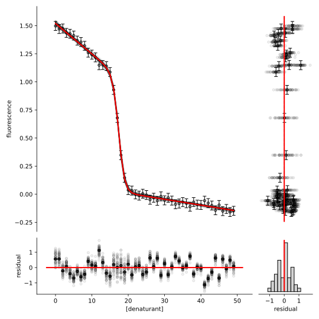
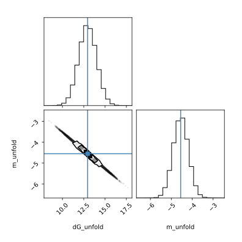
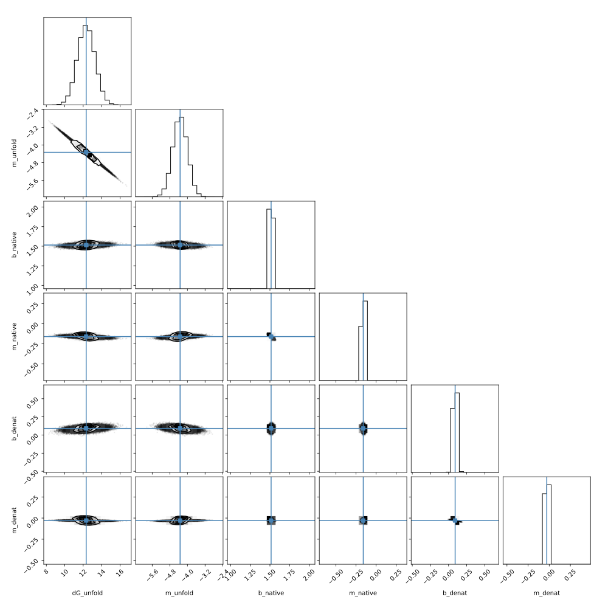
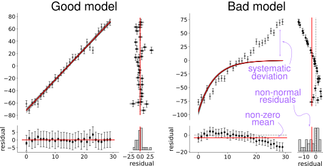

.. include:: links.rst

========
Overview
========

dataprob was designed to allow scientists to easily fit user-defined models to
experimental data. It allows maximum likelihood, bootstrap, and Bayesian
analyses with a simple and consistent interface.

Design principles
=================

+ **ease of use:** Users write a python function that describes their model,
  then load in their experimental data as a dataframe.
+ **dataframe centric:** Uses a pandas dataframe to specify parameter bounds,
  guesses, fixedness, and priors. Observed data can be passed in as a
  dataframe or numpy vector. All outputs are pandas dataframes.
+ **consistent experience:** Users can run maximum-likelihood, bootstrap
  resampling, or Bayesian analyses with an identical interface and nearly
  identical diagnostic outputs.
+ **interpretable:** Provides diagnostic plots and runs tests to validate
  fit results.

Examples
========

A good way to learn how to use the library is by working through examples. The
following notebooks are included in the `dataprob/examples/` directory. They are
self-contained demonstrations in which dataprob is used to analyze various
classes of experimental data. The links below launch each notebook in Google
Colab:

+ `api-example.ipynb <api-example_>`_: shows various features of the API when analyzing a linear model
+ `linear.ipynb <linear-example_>`_: fit a linear model to noisy data (2 parameter, linear)
+ `binding.ipynb <binding-example_>`_: a single-site binding interaction (2 parameter, sigmoidal curve)
+ `michaelis-menten.ipynb <michaelis-menten-example_>`_: Michaelis-Menten model of enzyme kinetics (2 parameter, sigmoidal curve)
+ `lagged-exponential.ipynb <lagged-exponential-example_>`_: bacterial growth curve with initial lag phase (3 parameter, exponential)
+ `multi-gaussian.ipynb <multi-gaussian-example_>`_: two overlapping normal distributions (6 parameter, Gaussian)
+ `periodic.ipynb <periodic-example_>`_: periodic data (3 parameter, sine)
+ `polynomial.ipynb <polynomial-example_>`_: nonlinear data with no obvious form (5 parameter, polynomial)
+ `linear-extrapolation-folding.ipynb <linear-extrapolation-folding-example_>`_: protein equilibrium unfolding data (6 parameter, linear embedded in sigmoidal)

I. Set up an analysis
=====================

----------------
1. Write a model
----------------

The first step is to define a function that we think can reproduce our
observations given some set of parameters. dataprob will find the values of
the `float <float-number_>`_ parameters passed to the function that reproduce
our observations. Such a function must meet two criteria:

+ The function must take parameters to fit. Parameters can be passed in as
  float keyword arguments to the function or as a numpy array of floats.
+ The function must return a numpy array the same length as the numpy array of
  observations.

For example, the function ``good_model`` below takes the arguments ``m``, ``b``,
and ``x``. If we pass in an array with 10 values for ``x``, the function
returns an output array with 10 values. We can thus use it to reproduce the 10
observations in ``y_obs``.

.. code-block:: python

    # define a model
    def good_model(m, b, x):
        return m*x + b

    # Array of x from 0->9
    x_input = np.arange(10)
    x_input.shape # --> (10,)

    # y_calc has a line with a slope of 1 and an intercept of 2 calculated at
    # x from 0 to 9
    y_calc = good_model(m=1, b=2, x=x_input)
    y_calc.shape # --> (10,)

    # y_obs is a line with a slope of 5 and an intercept of 2 observed at x
    # from 0 to 9
    y_obs = x_input*5 + 2
    y_obs.shape # --> (10,)

-------------------
2. Set up the model
-------------------

We set up the analysis by calling ``dataprob.setup`` on our function to analyze.
This returns a ``Fitter`` object. (We will call this object ``f`` in this and
all following examples.) ``dataprob.setup`` guesses which parameters should be
fittable. By default, it treats the first ``n`` arguments of the input function
whose default is a ``float`` or ``None`` as fittable parameters. All remaining
arguments are treated as non-fittable. For example, in the following code block
``dataprob.setup`` identifies ``a`` and ``b`` as fit parameters, but not
``square``.

.. code-block:: python

    def some_fcn(a, b=2, square=False):
        if square is True:
            return a**2 + b
        else:
            return a + b

    f = dataprob.setup(some_fcn)
    print(f.param_df["name"])  # -> ["a", "b"]

One can change this behavior using the ``fit_parameters``, ``non_fit_kwargs``
and ``vector_first_arg`` arguments to ``dataprob.setup``. A few patterns
demonstrate how this works.

.. code-block:: python

    # A function we wish to analyze
    def some_fcn(a=1, b=2, c=3):
        return a*b*c

    # a, b, and c are fit parameters with guesses of 1, 2, and 3, taken from
    # their argument defaults.
    f = dataprob.setup(some_fcn)

    # b and c are fit parameters with guesses of 2 and 3; a is a fixed
    # non-fittable parameter with value 1
    f = dataprob.setup(some_fcn,
                       fit_parameters=["b", "c"])

    # a and c are fit parameters with guesses of 1 and 3; b is a non-fittable
    # parameter with a value of np.arange(20)
    f = dataprob.setup(some_fcn,
                       non_fit_kwargs={"b": np.arange(20)})

    # a and c are fit parameters with guesses of 14 and 7; b is a non-fittable
    # parameter with a value of np.arange(20)
    f = dataprob.setup(some_fcn,
                       fit_parameters={"a": 14, "c": 7},
                       non_fit_kwargs={"b": np.arange(20)})

The ``vector_first_arg`` argument enables one to use a function where the first
argument is an array of parameters. This allows for computationally efficient
models that deal exclusively in numpy arrays. Note that a ``fit_parameters``
argument is required if ``vector_first_arg == True``. Here is an example:

.. code-block:: python

    def some_fcn(a, b=2, c=3):
        return a*b*c

    # Treat "a" as a vector rather than as a single parameter. This vector is
    # built from parameters w, x, y, and z. (Assigned default guesses of 0). b
    # and c are fixed non-fittable parameters with values of 2 and 3.
    f = dataprob.setup(some_fcn,
                       vector_first_arg=True,
                       fit_parameters=["w", "x", "y", "z"])

    # When running the analysis, dataprob will do the following under the hood.
    y_calc = some_fcn(a=np.array([w, x, y, z]), b=2, c=3)

One can even more finely control the assignment of fittable parameters: see the
`Advanced model definitions`_ section for details.

-------------------------------
3. Customize the fit parameters
-------------------------------

Once we have defined our model and assigned which parameters are fittable, we
can control seven attributes of each fittable parameter. These are stored in
``f.param_df`` dataframe. Each row is a parameter; each column is an attribute.

.. code-block:: python

    def some_fcn(a, b=2, c=3):
        return a*b*c

    f = dataprob.setup(some_fcn)

    f.param_df

+-------+-------+-----------+-------------+-------------+------------+-----------+
| name  | guess | fixed     | lower_bound | upper_bound | prior_mean | prior_std |
+=======+=======+===========+=============+=============+============+===========+
| ``a`` | 0.0   | ``False`` | ``-inf``    | ``inf``     | ``NaN``    | ``NaN``   |
+-------+-------+-----------+-------------+-------------+------------+-----------+
| ``b`` | 2.0   | ``False`` | ``-inf``    | ``inf``     | ``NaN``    | ``NaN``   |
+-------+-------+-----------+-------------+-------------+------------+-----------+
| ``c`` | 3.0   | ``False`` | ``-inf``    | ``inf``     | ``NaN``    | ``NaN``   |
+-------+-------+-----------+-------------+-------------+------------+-----------+

The ``f.param_df`` dataframe can be accessed and edited using standard
`pandas DataFrame <pandas-dataframe_>`_ commands. The ``name`` column is set
when the dataframe is initialized and cannot be changed. The ``name`` column is
used as the index for the dataframe, allowing commands like the following, which
sets the ``guess`` of parameter ``a`` to 10.0:

.. code-block:: python

    # set the guess of parameter a to 10.0.
    f.param_df.loc["a", "guess"] = 10.0

One can also edit the dataframe en masse and load in directly:

.. code-block:: python

    df = f.param_df.copy()

    # do lots of edits to dataframe
    # ...
    # then:

    f.param_df = df

One can even load ``param_df`` directly from a spreadsheet.

.. code-block:: python

    f.param_df.to_excel("my-parameters.xlsx")

    # edit my-parameters.xlsx in Excel.

    f.param_df = "my-parameters.xlsx"

The full rules for the parameter dataframe are:

+-----------------+---------------------------------------------------------+
| key             | value                                                   |
+=================+=========================================================+
| ``name``        | string name of the parameter. should not be changed     |
|                 | by the user once the fitter is initialized.             |
+-----------------+---------------------------------------------------------+
| ``guess``       | initial guess as single float value (must be non-nan    |
|                 | and within bounds if specified)                         |
+-----------------+---------------------------------------------------------+
| ``fixed``       | whether or not parameter can vary during the analysis;  |
|                 | ``True`` or ``False``. if ``True`` use the value in     |
|                 | ``guess`` for this argument when calling the function.  |
+-----------------+---------------------------------------------------------+
| ``lower_bound`` | parameter constrained to be ``>= lower_bound``. single  |
|                 | float value; ``-np.inf`` allowed; ``None``, ``np.nan``, |
|                 | or ``pd.NA`` interpreted as ``-np.inf``.                |
+-----------------+---------------------------------------------------------+
| ``upper_bound`` | parameter constrained to be ``<= upper_bound``. single  |
|                 | float value; ``np.inf`` allowed; ``None``, ``np.nan``,  |
|                 | or ``pd.NA`` interpreted as ``np.inf``.                 |
+-----------------+---------------------------------------------------------+
| ``prior_mean``  | single float value; ``np.nan`` allowed (see note)       |
+-----------------+---------------------------------------------------------+
| ``prior_std``   | single float value; ``np.nan`` allowed (see note)       |
+-----------------+---------------------------------------------------------+

.. note::

    Bayesian analyses require prior distributions for each parameter. (See the
    individual fitter pages for details.) Priors are specified using the
    ``prior_mean`` and ``prior_std`` columns. Together, these define a Gaussian
    prior with a mean of ``prior_mean`` and a standard deviation of
    ``prior_std``. Because they specify a Gaussian distribution, neither
    value can be ``np.inf`` and ``prior_std`` must be greater than zero. If
    both a Gaussian prior and bounds are defined, the Gaussian distribution is
    trimmed and re-normalized so its probability density function sums to one
    between the bounds. To use uniform priors between the bounds, set both
    ``prior_mean`` and ``prior_std`` to ``np.nan``.

-----------------------------
4. Set non-fittable arguments
-----------------------------

One can specify arguments to the function that should not be used as fit
parameters using the ``non_fit_kwargs`` dictionary. This can be passed as an
argument to ``dataprob.setup``. All keys must correspond to function arguments,
except in the `special case <Functions with \*\*kwargs_>`_ where a function
takes ``**kwargs``. The ``non_fit_kwargs`` dictionary can be accessed and edited
after initialization; it is exposed as an attribute to ``f``. In the following
example, we initially set the value of ``square`` to be ``True``, then update
that to be ``False``.

.. code-block:: python

    def some_fcn(a, b=2, square=False):
        if square is True:
            return (a*b)**2
        else:
            return (a*b)

    # Initially set square to True
    f = dataprob.setup(some_fcn,
                       non_fit_kwargs={"square": True})

    # Oops, changed our mind. Set back to False
    f.non_fit_kwargs["square"] = False

II. Run an analysis
===================

----------------------------
1. Select an analysis method
----------------------------

dataprob has five analysis methods to estimate parameter values. These are
selected via the ``method`` argument to ``dataprob.setup``:
:code:`f = dataprob.setup(some_fcn, method="ml")`. If no method is specified,
the ``ml`` method will be used. The available methods are:

+ **ml** (default). Do a maximum likelihood (i.e. least-squares) fit, regressing
  model parameters against observed data. It finds the parameters that minimize
  the weighted residual function. `Details <fitters/ml>`_.

+ **bootstrap**: Estimate parameter distributions consistent with observed data
  by sampling observation uncertainty, then finding maximum likelihood
  parameter estimates for each pseudo-replicate dataset. `Details <fitters/bootstrap>`_.

+ **emcee**: Use an affine-invariant ensemble sampler to estimate the posterior
  distributions of model parameters via Markov-Chain Monte Carlo. `Details <fitters/emcee>`_.

+ **pymc**: Use PyMC's NUTS sampler for gradient-based Bayesian posterior
  sampling with multiple chains and convergence diagnostics. `Details <fitters/pymc>`_.

+ **hmc**: Use a self-contained Hamiltonian Monte Carlo sampler. Efficient with
  an analytical Jacobian; supports checkpoint/resume for long runs. `Details <fitters/hmc>`_.

--------------------
2. Load observations
--------------------

All analyses require the user specify a vector of observations (``y_obs``) and
a vector of standard deviations on the value of each observation (``y_std``).
The software will estimate model parameters that reproduce the observations in
``y_obs``, weighted by the confidence in each observation encoded by
``y_std``. ``y_obs`` and ``y_std`` must be non-nan float values. Further, all
values in ``y_std`` must be larger than zero.

The analysis makes several assumptions about ``y_obs`` and ``y_std``.

+ The error of the independent variable is negligible. For example, if you were
  to measure the progress of a chemical reaction over time, this software
  assumes no error in your time measurement.
+ The errors in each observation are independent.
+ The uncertainty for each observation value is normally distributed, with a
  standard deviation of ``y_std``.

.. note::

    dataprob assumes the ``y_std`` are `population standard deviations <pop-std_>`_,
    not sample standard deviations. We therefore recommend that users
    calculate ``y_std`` as:

    .. math::

        \sigma = \sqrt{ \frac{1}{N-1} \sum_{i=0}^{i < N-1} \left ( x_{i} - \mu \right )^2}

    where :math:`N` is the number of replicates for a given observation and
    :math:`\mu` is the mean of the replicates.

.. note::

    A typical way to estimate ``y_std`` is via technical replicates on each
    observed point. Sometimes this is not possible. In this case, one can
    declare a global ``y_std`` for all points based on an overall estimate of
    observation precision. For example, one might take the standard deviation of
    points from a flat experimental baseline and use that as the value for
    ``y_std`` on all points. One could even "make up" a value that "seems
    plausible" given the instrument setup and collected data. If one uses the
    same ``y_std`` for all points, the chosen value will not alter the parameter
    estimates, but it will directly impact the final parameter estimate
    uncertainty. We thus recommend being conservative and assuming your error is
    on the large side of plausible. **If you underestimate y_std,
    you overestimate parameter precision!** The
    `reduced chi² output <Assessing fit quality_>`_ from ``f.fit_quality``
    can help you decide if you are grossly under- or over-estimating your
    observation uncertainty.

``y_obs`` and ``y_std`` can be passed to the program in two different ways.
The first is via ``f.fit``:

.. code-block:: python

    def some_fcn(a, b=2, c=3):
        return a*b*c

    f = dataprob.setup(some_fcn)

    f.fit(y_obs=y_obs,
          y_std=y_std)

The ``f.fit`` call also allows the user to specify a single, global ``y_std`` to
use for all observations:

.. code-block:: python

    # apply uncertainty of 0.1 to all observations
    f.fit(y_obs=y_obs,
          y_std=0.1)

In addition to using ``f.fit``, one can set ``y_obs`` and ``y_std`` from a
dataframe via the ``data_df`` attribute.

.. code-block:: python

    import pandas as pd

    df = pd.DataFrame({"y_obs": y_obs,
                       "y_std": y_std})

    f = dataprob.setup(some_fcn)

    f.data_df = df

    f.fit()

A dataframe passed to ``data_df`` must have a ``y_obs`` and a ``y_std`` column.
All other columns are ignored. The input dataframe must be either a pandas
``DataFrame`` or a string pointing to a spreadsheet that can be read by pandas.

-------------------
3. Run the analysis
-------------------

As described above, we run the analysis by calling ``f.fit()``. Each method
has different options that can be passed to the ``fit`` method — see the
individual fitter pages for details.

III. Results
============

-------------------------
Parameter values (fit_df)
-------------------------

One accesses the parameter estimates via the ``f.fit_df`` pandas dataframe.
All methods produce identical columns, though the meaning of ``estimate``,
``std``, and the 95% intervals differs slightly by method.

+-------+----------+-------+--------+---------+-------+-----------+
| name  | estimate | std   | low_95 | high_95 | ...   | prior_std |
+=======+==========+=======+========+=========+=======+===========+
| ``m`` | 5.009    | 0.045 | 4.817  | 5.202   | ...   | ``NaN``   |
+-------+----------+-------+--------+---------+-------+-----------+
| ``b`` | 5.644    | 0.274 | 4.465  | 6.822   | ...   | ``NaN``   |
+-------+----------+-------+--------+---------+-------+-----------+

**ml**
  + ``estimate``: maximum-likelihood parameter estimate.
  + ``std``: standard deviation of a parameter uncertainty distribution
    calculated assuming normally distributed error centered on the
    maximum-likelihood estimate. Distribution width is determined by the local
    curvature of the likelihood surface.
  + ``low_95`` and ``high_95``: 95% `confidence interval <confidence-interval_>`_.

**bootstrap**
  + ``estimate``: the mode of the parameter values seen across bootstrap
    pseudo-replicates.
  + ``std``: standard deviation of this parameter over the pseudo-replicate fits.
  + ``low_95`` and ``high_95``: 95% interval determined numerically, making no
    assumption about the shape of the distribution.

**emcee / pymc / hmc**
  + ``estimate``: the mode of the parameter values seen in the posterior
    distribution.
  + ``std``: standard deviation of this parameter over the posterior distribution.
  + ``low_95`` and ``high_95``: 95% `credible interval <credible-interval_>`_
    determined numerically.

In addition to the analysis output, the ``fit_df`` column holds the parameter
constraints that went into the analysis (``guess``, ``fixed``, ``upper_bound``,
``lower_bound``, ``prior_mean``, and ``prior_std``).

One can save this dataframe out to a spreadsheet
(``f.fit_df.to_excel("fit-results.xlsx")``) to preserve both the parameter fit
results and parameter inputs in a single file.

-----------------------
Model outputs (data_df)
-----------------------

After a fit is run, the ``f.data_df`` dataframe now has three new columns:

+ ``y_calc``: the model calculated using the parameters in ``f.fit_df["estimate"]``.
+ ``unweighted_residuals``: the difference between the model and the data
  (``y_calc - y_obs``).
+ ``weighted_residuals``: the difference between the model and the data weighted
  by observation uncertainty (``(y_calc - y_obs)/y_std``).

One might call something like the following to make a plot of experimental
points in ``y_obs`` with a line showing ``y_calc``.

.. code-block:: python

    from matplotlib import pyplot as plt

    plt.plot(f.data_df["y_obs"], "o")
    plt.plot(f.data_df["y_calc"], "-")

-------
Samples
-------

After ``f.fit()`` runs, a fitter object will have an attribute ``f.samples``.
This is a numpy array with shape ``(num_samples, num_params)`` that holds
vectors of parameters sampled from the conditional parameter probability
distribution. These samples are used to draw the gray fit lines in a summary
plot and to construct the distributions in a corner plot. The samples are
calculated in different ways for the different methods.

+ **ml**: Samples parameter values from the covariance matrix assuming that the
  parameter uncertainty is normally distributed and centered on the maximum
  likelihood parameter estimate. See the :doc:`fitters/ml` page for details.
+ **bootstrap**: Each sample is the result of a maximum likelihood fit of the
  model to a pseudo-replicate dataset generated by sampling from
  observation uncertainty. See the :doc:`fitters/bootstrap` page for details.
+ **emcee / pymc / hmc**: Records the locations of sampled parameter vectors as
  they traverse the posterior. Each sample is a draw from the conditional
  parameter posterior distribution. See the individual fitter pages for details.

One can also run the ``f.get_sample_df()`` method to get a dataframe holding
the sample outputs rather than sample parameter estimates. This will look
something like the following, where ``y_calc`` is calculated using the
parameters in ``f.fit_df["estimate"]`` and the columns beginning with ``s00``
are the model evaluated with the sampled parameter values.

+-------+-------+--------+---------+---------+-----+
| y_obs | y_std | y_calc | s000000 | s000001 | ... |
+=======+=======+========+=========+=========+=====+
| -5    | 1     | -4.9   | -4.8    | -5.2    | ... |
+-------+-------+--------+---------+---------+-----+
| ...   | ...   | ...    | ...     | ...     | ... |
+-------+-------+--------+---------+---------+-----+

------------
Summary plot
------------

The summary plot allows the user to assess how well the model reproduces the
observations with four combined plots.

.. code-block:: python

    # assuming f is a Fitter object for which f.fit() has been run
    fig = dataprob.plot_summary(f)
    fig.savefig("summary-plot.pdf")

Here is an example output for a six-parameter model of protein folding (see this
`notebook <linear-extrapolation-folding-example_>`_ for details).

The **central plot** shows ``y_obs`` (y-axis) in the order they came in via the
input array (x-axis). Each point is an observation with its ``y_std`` shown as
error bars. The red line shows the output of the model calculated using the
parameters in ``f.fit_df["estimate"]``. The cloud of gray lines shows the output
of the model calculated with parameters drawn from ``f.samples``.

The **lower plot** shows the model residuals as a function of observation number,
while the **right plot** shows the model residuals as a function of ``y_obs``.
The residual is calculated as ``(y_calc - y_obs)/y_std``, where ``y_calc`` is
calculated using the parameters in ``f.fit_df["estimate"]``. The error bars are
``y_std``. The cloud of gray points are residuals when the model is calculated
using parameters drawn from ``f.samples``. The red line shows the residual mean.

The **bottom right plot** shows a histogram of the residual values, using an
x-axis shared by the plot above.

For help interpreting these outputs, see the `Assessing fit quality`_ section.

One can control the style of the plot with the arguments passed to
``dataprob.plot_summary``. Key arguments include:

+ ``x_axis`` is a list of values to use for the x-axis. The length of this list
  must match the length of ``y_obs``. If this is not specified, ``y_obs`` are
  simply plotted sequentially.
+ ``plot_unweighted`` allows the user to select whether to plot weighted or
  unweighted residuals.
+ ``x_label`` and ``y_label`` allow the user to label the axes.
+ The ``*_style`` arguments allow the user to control how the plot
  components are drawn. These should be dictionaries holding arguments to be
  passed to `matplotlib plot <pyplot_>`_ calls. For example, one could use
  :code:`y_obs_style={"marker": "+"}` to change the marker style for the
  data points to ``+`` symbols. The dictionaries available are:

  + ``y_obs_style`` for observations, passed to
    `matplotlib scatter <pyplot-scatter_>`_.
  + ``y_std_style`` for observation standard deviations, passed to
    `matplotlib errorbar <pyplot-errorbar_>`_.
  + ``y_calc_style`` for model lines in main plot and residuals, passed to
    `matplotlib plot <pyplot_>`_.
  + ``sample_line_style`` for sample lines in main plot, passed to
    `matplotlib plot <pyplot_>`_.
  + ``sample_point_style`` for sample points in residuals plots, passed to
    `matplotlib scatter <pyplot-scatter_>`_.
  + ``hist_bar_style``, for bars in residual histogram, passed to
    `matplotlib fill <pyplot-fill_>`_.

-----------
Corner plot
-----------

The corner plot allows the user to visually assess how well determined each
parameter is and the extent to which parameter estimates co-vary with
one another. The meaning of the distributions is slightly different for each
method; see the `Samples`_ section above for details.

In the example above, we see that the ``dG_unfold`` parameter varies between
about -10 and -15 (top left) and that ``m_unfold`` varies between -5.5 and -3.5
(bottom right). These values are not independent of one another. The
correlation plot (bottom left) reveals that the estimates of the two parameters
strongly co-vary. Knowing about co-variation is helpful for a number of reasons.

1. If the reduced :math:`\chi^{2}` suggests overfitting, the corner plot can
   reveal which parameters are unconstrained and should be fixed or removed
   from the model.
2. If we have two correlated parameters and can find an independent way to
   estimate one of the parameters — say, with a different experiment — we know
   we can then estimate the other parameter.
3. It might make sense to fold these two parameters into a single parameter.
   From the example above, we might re-write the model with a single parameter
   that is the ratio of ``dG_unfold`` and ``m_value``.
4. When presenting results in a publication, a co-variation plot allows the
   reader to understand what an uncertainty like
   :math:`\Delta \hat{G}_{unfold} = -12.5 \pm 2.5` means with respect to the
   other parameters in the dataset.

One feature of ``dataprob.plot_corner`` is the ability to filter parameters.
The model above has six parameters, many of which are 'nuisance' parameters that
are important for the fit but do not provide information about the (in this case)
protein chemistry. We generated the above plot using the following command:

.. code-block:: python

    dataprob.plot_corner(f, filter_params=["native", "denat"])

This removed any parameter that had the text "native" or "denat" in its name.
If we run the same call without the filter, we get the full corner plot with
all six parameters.

This larger plot is useful — and should generally be checked to make sure nothing
unexpected is going on with the nuisance parameters — but it also buries the
results for the two parameters we care the most about (``dG_unfold`` and
``m_unfold``). See ``help(dataprob.plot_corner)`` for details on filtering.

---------------------
Assessing fit quality
---------------------

A model that describes the data well will have three features:

1. The residuals will be normally distributed.
2. The residuals will have a mean of zero.
3. There will be no systematic deviation between the model and data (implying
   the residuals will be uncorrelated).

The following graphic compares a good model (left) to a bad model (right),
highlighting the problems in purple.

Aside from allowing visual assessment, dataprob calculates quality metrics for
each fit. These are accessible via the ``f.fit_quality`` dataframe. The
dataframe has the name and description of each analysis, whether the model
passes the test (``is_good``) and the value of the test result (``value``). The
dataframe also has a ``message`` column to help the user interpret the results.
The results for a "bad model" fit are shown below:

+---------------+---------------------------------------------+---------+---------+
| index         | description                                 | is_good | value   |
+===============+=============================================+=========+=========+
| success       | fit success status                          | True    | True    |
+---------------+---------------------------------------------+---------+---------+
| num_obs       | number of observations                      | True    | 30.0    |
+---------------+---------------------------------------------+---------+---------+
| num_param     | number of floating fit parameters           | True    | 2.0     |
+---------------+---------------------------------------------+---------+---------+
| lnL           | log likelihood                              | True    | -652.94 |
+---------------+---------------------------------------------+---------+---------+
| chi2          | chi² goodness-of-fit                        | False   | 0.0     |
+---------------+---------------------------------------------+---------+---------+
| reduced_chi2  | reduced chi²                                | False   | 42.748  |
+---------------+---------------------------------------------+---------+---------+
| mean0_resid   | t-test for residual mean != 0               | False   | 0.0018  |
+---------------+---------------------------------------------+---------+---------+
| durbin-watson | Durbin-Watson test for correlated residuals | False   | 0.036   |
+---------------+---------------------------------------------+---------+---------+
| ljung-box     | Ljung-Box test for correlated residuals     | False   | 0.000   |
+---------------+---------------------------------------------+---------+---------+

The first four entries describe the model:

+ Whether or not the fit terminated successfully.
+ The number of floating parameters.
+ The number of observations in ``y_obs``.
+ The log likelihood of the parameters in ``f.fit_df["estimate"]``.

``num_obs`` and ``lnL`` will always have ``is_good == True``. ``num_param`` will
fail if the number of parameters is greater than the number of observations.

The remaining entries allow the user to assess model quality.

Model goodness-of-fit
~~~~~~~~~~~~~~~~~~~~~

The ``chi2`` and ``reduced_chi2`` statistics assess whether the distribution of
residuals matches what we would expect for a well-fit model.

+ **chi2**: Runs a :math:`\chi^{2}` goodness-of-fit analysis. The null
  hypothesis is that the fit residuals can be described by a :math:`\chi^{2}`
  distribution. If the p-value is less than 0.05, ``is_good`` is set to
  ``False``. If this test fails, you may need to use a different model to
  describe your data.

+ **reduced_chi2**: The reduced :math:`\chi^{2}` (:math:`\chi^{2}/N` where
  :math:`N` is the number of fit parameters) should be close to 1 for a
  well-fit model.

  + A value greater than 1.25 may mean the model does not describe the data
    well, or that ``y_std`` is underestimated. Try increasing the magnitude of
    ``y_std``, or if other tests are also failing, consider a different model.
  + A value below 0.75 may mean the model is overfit or that ``y_std`` is
    overestimated. Check the corner plot for strongly co-varying parameters.

Residuals with zero mean
~~~~~~~~~~~~~~~~~~~~~~~~

+ **mean0_resid**: Runs a one-sample, two-tailed t-test for whether the mean of
  the residuals is zero. A p-value less than 0.05 sets ``is_good`` to ``False``.
  If this test fails, you may need to use a different model to describe your
  data.

Residual correlation
~~~~~~~~~~~~~~~~~~~~

A well-fit model should have residuals that are uncorrelated along ``y_obs``.
Correlated residuals arise when the model systematically differs from the data.
dataprob runs two tests for correlated residuals.

+ **Durbin-Watson**: The `Durbin-Watson <durbin-watson_>`_ statistic :math:`D`
  ranges from 0 to 4. A value of 2 indicates no detected correlation; values
  below 2 indicate positive autocorrelation; values above 2 indicate negative
  autocorrelation. If :math:`D < 1` or :math:`D > 3`, ``is_good`` is set to
  ``False``. If this test fails, you may need to use a different model.

+ **Ljung-Box**: The `Ljung-Box <ljung-box_>`_ test statistic :math:`Q` is
  expected to follow a :math:`\chi^{2}` distribution under the null hypothesis
  of uncorrelated residuals. If the p-value is less than 0.05, ``is_good`` is
  set to ``False``. If this test fails, you may need to use a different model.

IV. Advanced model definitions
==============================

--------------
fit_parameters
--------------

In addition to defining names, the ``fit_parameters`` argument to ``dataprob.setup``
can be used to declare parameter attributes (``guess``, ``fixed``, ``lower_bound``,
``upper_bound``, ``prior_mean``, and ``prior_std``). To do this,
``fit_parameters`` can be one of five different types:

+ **list.** Each entry is the name of the parameter as a string (e.g. ``["a", "b"]``).

+ **dict with float values.** The keys are the parameter names; the values
  are the parameter guesses (e.g. ``{"a": 5, "b": 11}``).

+ **dict with dict values.** The keys are the parameter names; the values
  are dictionaries keying parameter attributes to their values. For example:

  .. code-block:: python

      fit_parameters = {"a": {"guess": 1, "lower_bound": 0},
                        "b": {"upper_bound": 20}}

  This indicates that parameter ``a`` should have a guess of ``1`` and a
  lower bound of zero. Parameter ``b`` should have an upper bound of ``20``.
  Note that the dictionary does not need to exhaustively define all parameter
  attributes. Any attributes not specified are assigned defaults.

+ **dataframe.** The dataframe must have a ``name`` column with parameter
  names. Columns then define parameter features, just like the ``param_df``
  dataframe. Not all columns must be present; missing attribute columns will
  be assigned their default values.

+ **string.** The software will treat this as a filename and will attempt to
  load it as a dataframe (``xlsx``, ``csv``, and ``tsv`` are recognized).

-------------------------
Functions with \*\*kwargs
-------------------------

Sometimes a python function has a ``**kwargs`` argument. This grabs any keyword
argument the user sends in that is not specified in the function definition and
passes it into the function. For example, the following function returns the
value of ``a`` unless ``b`` is also passed to the function, in which case it
returns ``a * b``.

.. code-block:: python

    def some_fcn(a=1, **kwargs):
        if "b" in kwargs:
            return a*kwargs["b"]
        else:
            return a

    print(some_fcn(a=5))     # --> 5
    print(some_fcn(a=5, b=2)) # --> 10

If a function has a ``**kwargs`` parameter, dataprob allows one to specify
arguments not in the function definition as ``fit_parameters`` or in
``non_fit_kwargs``. For example:

.. code-block:: python

    def some_fcn(a=1, **kwargs):
        # do stuff here
        return some_1d_numpy_array

    f = dataprob.setup(some_fcn,
                       fit_parameters=["a", "b", "c"])

    # When running the analysis, dataprob will do the following under the hood.
    y_calc = some_fcn(a=a_value, b=b_value, c=c_value)
